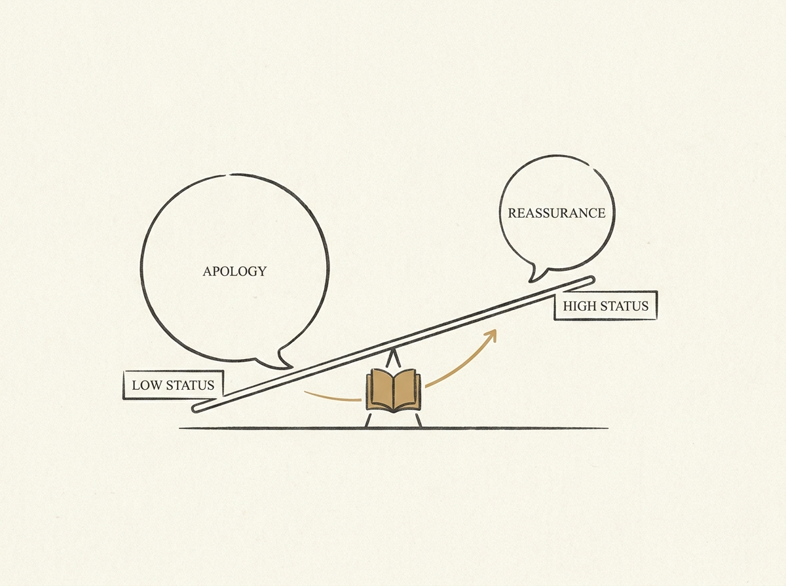

---
authors:
- zuzuleinen
comments: https://news.ycombinator.com/item?id=48965130
date: '2026-07-19'
hn_id: '48965130'
image: 45-hn-48965130-infographic.png
interest_score: 7
section: career
source: hn
tags:
- catchup
- creativity
- cults
- hn
- impro
- silicon-valley
- status-games
title: Impro is a handbook for running a cult and understanding status
url: https://www.seangoedecke.com/impro/
why_read: This text explores Keith Johnstone's *Impro*, explaining its core ideas
  on creativity and its unexpected relevance in Silicon Valley. Readers will learn
  about the pervasive nature of status games in social interactions and how the book
  acts as a guide for understanding and manipulating them.
---

Keith Johnstone's "Impro" is not just about improv; it is a profound text influencing Silicon Valley, particularly for its insights into social dynamics and "status games" at work. This book reveals how even innocuous conversations are bids for status.

Understanding these unspoken dynamics can significantly impact your career. For example, apologizing too often signals low status, while reassurance can signal high status. Learning to deliberately adjust your status performance can make you a more effective communicator and leader.

This is not about manipulation, but about conscious communication. It helps you navigate team interactions and leadership roles with greater awareness, ultimately fostering more effective collaboration.