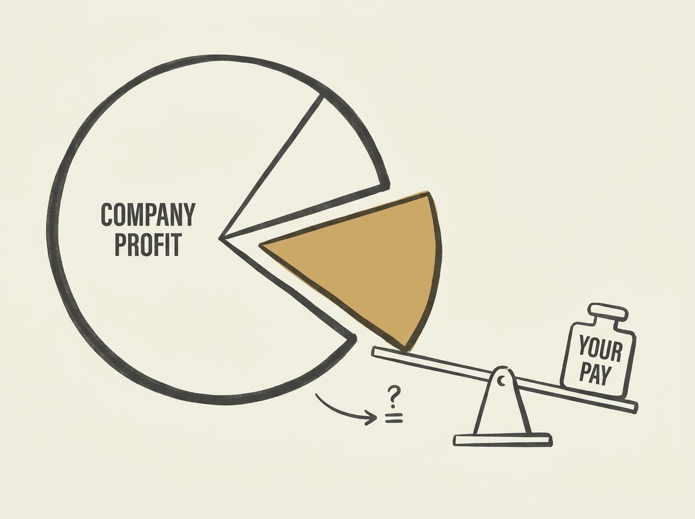

---
authors:
- IESAI_ski
comments: https://news.ycombinator.com/item?id=48970684
date: '2026-07-19'
hn_id: '48970684'
image: 46-hn-48970684-infographic.png
interest_score: 7
section: career
source: hn
tags:
- catchup
- employee-compensation
- employer-profits
- fair-share
- hn
- salary-analysis
- sec-filings
title: Calculate your fair share of employer profits
url: https://yourfairshare.info
why_read: This tool allows users to calculate their 'fair share' of their employer's
  profits based on their compensation and public financial data. It helps in understanding
  the financial relationship between employee salaries and company profitability.
---

Ever wondered how much profit your employer generates per employee? A new tool, yourfairshare.info, lets you find out by analyzing public SEC filings for US-listed companies.

You can input your compensation and see your company's profit per employee, offering a clear, data-driven perspective on your value. This transparency can be a game-changer for salary negotiations and career planning.

Understanding your company's financial output on a per-employee basis provides leverage and context that is often missing from compensation discussions. It is a powerful way to assess if your share truly reflects your contribution.