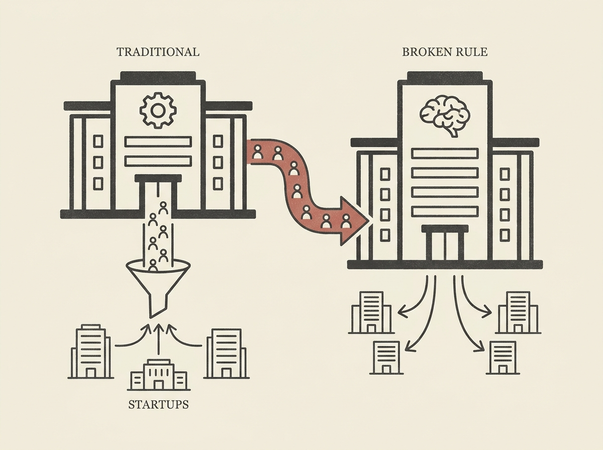

---
authors:
- Alistair Barr
comments: https://news.ycombinator.com/item?id=48969975
date: '2026-07-19'
hn_id: '48969975'
image: 47-hn-48969975-infographic.png
interest_score: 7
section: career
source: hn
tags:
- catchup
- disruption
- hn
- openai-strategy
- silicon-valley-culture
- startup-big-tech-relations
title: Apple is angry OpenAI broke Silicon Valley's unspoken rule
url: https://www.businessinsider.com/openai-breaking-silicon-valley-unspoken-rule-apple-talent-2026-7
why_read: This article explains why Apple is angry with OpenAI, detailing how OpenAI's
  strategy breaks the traditional unspoken rules of the Silicon Valley startup ecosystem
  and Big Tech's comfortable arrangement. You will learn about the typical power dynamics
  between established tech giants and emerging startups.
---

OpenAI is shaking up Silicon Valley by challenging its long-standing "unspoken rules" for startups and talent, a move that is visibly upsetting established giants like Apple. Traditionally, successful startups either remained niche suppliers or became acquisition targets, funneling talent back into Big Tech.

OpenAI, however, is charting a different course. It is aggressively poaching top talent and developing foundational technology that directly competes with existing ecosystems, rather than merely supplementing them. This breaks the implicit agreement that startups largely feed into, rather than fundamentally disrupt, the dominant players' control.

This shift in strategy highlights the intense competition for AI talent and foundational models. For senior engineers, understanding these industry dynamics is crucial for career planning, identifying genuine innovation hubs, and recognizing where future opportunities and challenges lie.

The Valley's old guard is realizing the game has changed.