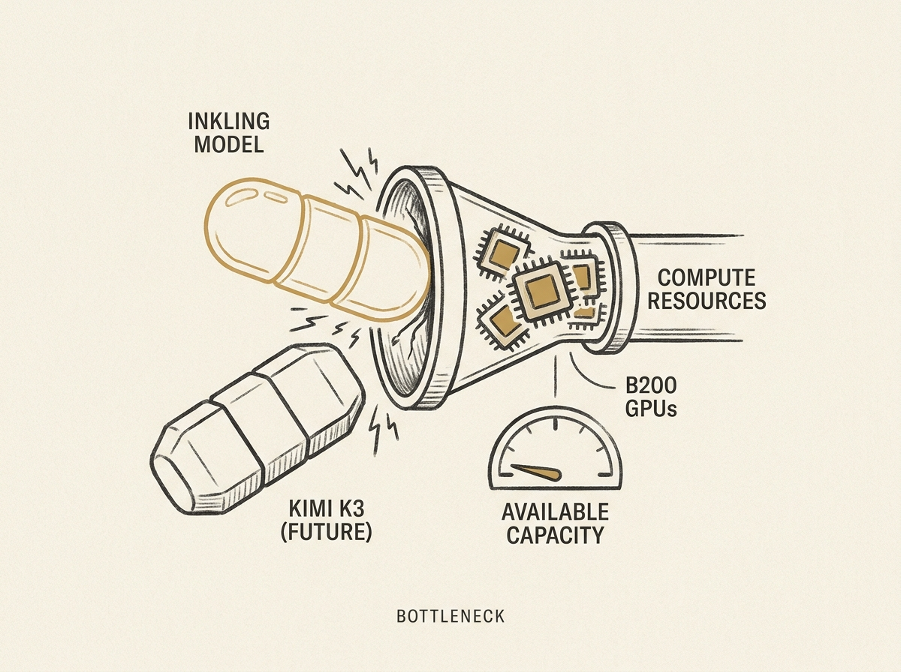

---
authors:
- Jaber
comments: https://news.ycombinator.com/item?id=48964020
date: '2026-07-19'
hn_id: '48964020'
image: 48-hn-48964020-infographic.png
interest_score: 7
section: ai
source: hn
tags:
- b200-gpu
- catchup
- cloud-providers
- gpu-shortage
- hn
- inkling-release
- kimi-k3
title: Inkling release causes B200 GPU shortage, Kimi K3 will be a disaster
url: https://twitter.com/Akashi203/status/2078615659366252877
why_read: This post offers a concise, speculative take on how new AI model releases
  might severely strain GPU supply. Readers will grasp a specific concern regarding
  future hardware availability for cloud providers.
---

The Inkling AI model release has apparently triggered a complete sell-out of B200 GPUs across all major cloud providers. This is not just a market blip; it signals a fundamental constraint in scaling advanced AI.

For senior engineers building or deploying large language models, this extreme scarcity means planning for infrastructure is more critical than ever. The tweet mentions anticipating a "huge disaster" with the upcoming Kimi K3, which underscores the escalating competition for compute resources.

Understanding these real-world bottlenecks directly impacts strategic decisions, from model training to production deployment. This is the new reality of high-performance AI.