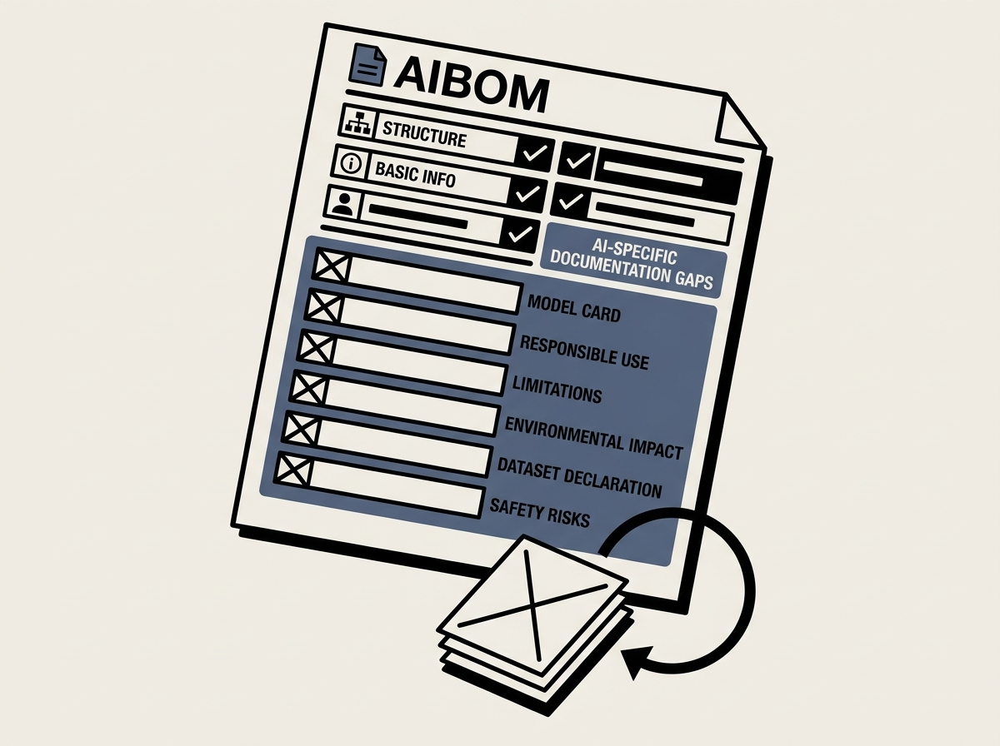

Transparency in the AI supply chain is not just a buzzword; it is a critical engineering practice. This large-scale study on Hugging Face models reveals a significant gap in Artificial Intelligence Bills of Materials (AIBOMs) completeness.

The research examined nearly 100,000 artifacts and found that while AIBOMs structurally exist, the AI-specific documentation - covering model cards, responsible use, limitations, and environmental impact - is often weakly represented or entirely missing. This creates substantial transparency and governance issues for engineers deploying these models.

For example, essential fields like dataset declarations, safety risk assessments, and meaningful descriptions are frequently absent. These omissions make it incredibly challenging to understand model provenance, potential biases, or suitability for specific applications.

This study is a call to action for improved model-card practices and automated AIBOM validation. Ensuring complete AIBOMs is paramount for building robust, ethical, and trustworthy AI systems.