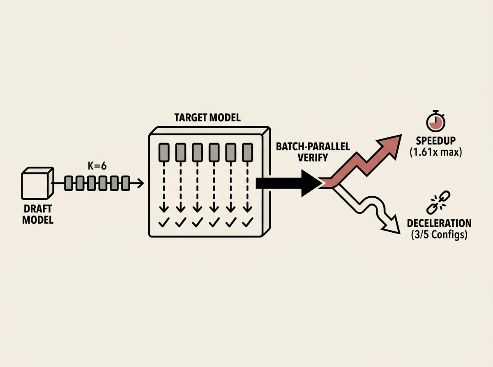

Speculative decoding is touted as a game-changer for LLM inference speed, but its 'lossless but not free' reality is often overlooked. This empirical study on consumer hardware provides critical insights into when it actually delivers.

The research shows a maximum 1.61x speedup at a draft length of K=6, with an acceptance rate dropping from 69.7% to 37.8%. Crucially, it found that three out of five configurations *decelerate*.

The key takeaways: speculative decoding pays off only when the verification process is genuinely batch-parallel and there is a significant latency gap between the draft and target models. This analysis is essential for anyone optimizing LLM deployment.