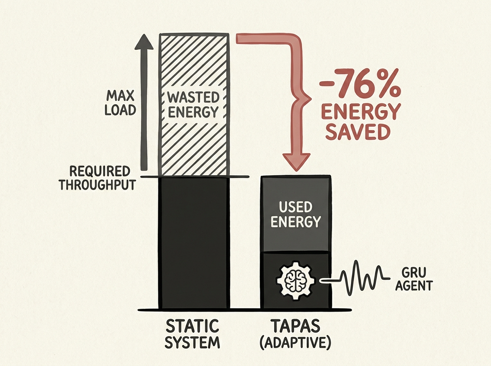

Autonomous systems struggle with perception modules that have dynamic throughput needs, often leading to over-provisioning or wasted energy. This is a common challenge when deploying AI at the edge.

A new paper introduces TAPAS, a throughput-adaptive perception strategy that uses Reinforcement Learning with a GRU agent to dynamically adjust resource allocation based on scene complexity. This intelligent approach ensures the required throughput is met while minimizing energy consumption.

Evaluated on Jetson Orin NX across KITTI and nuScenes datasets, TAPAS achieved 93-100% throughput met rates and an impressive 76% energy saving. For engineers building real-time AI systems on mobile or edge platforms, this work offers a valuable blueprint for efficient resource management.