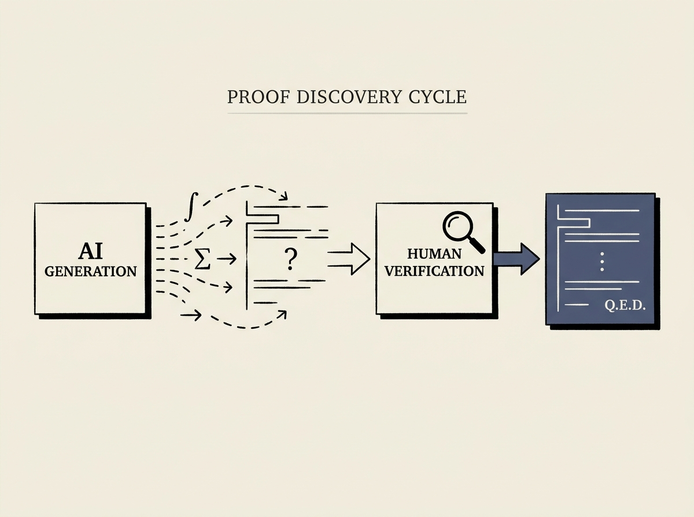

Can LLMs truly contribute to scientific discovery, or are they just sophisticated autocomplete? A new paper suggests the former, showing AI systems generating novel mathematical proofs.

In the complex field of Banach space theory, AI systems generated key ideas and proofs for five new results, which were subsequently verified and refined by human mathematicians. This is not about solving known problems, but genuinely discovering new knowledge.

The researchers also developed an automated system to search the literature for open problems and attempt solutions at scale. This work highlights the growing potential of language models as powerful assistants for intellectual discovery, pushing the boundaries of what applied AI can achieve in scientific research.