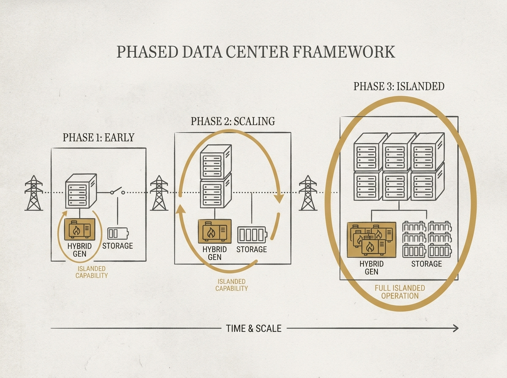

Hyperscale AI data centers, often 500MW to 2GW, present immense challenges to the electric grid. How do you deploy them scalably and ensure resilience? A new phased development framework offers solutions.

This framework tackles the multi-year constraints of grid interconnection and component procurement by proposing modular construction with hybrid on-site generation and grid-forming energy storage. The goal is enabling "islanded operation" during grid disturbances, a critical feature for AI infrastructure.

Electromagnetic transient simulations validate the system's performance, showing how on-site natural gas and grid-forming energy storage can reliably support data center operations even in early deployment phases. This is essential reading for any senior engineer involved in the infrastructure powering the next generation of AI.