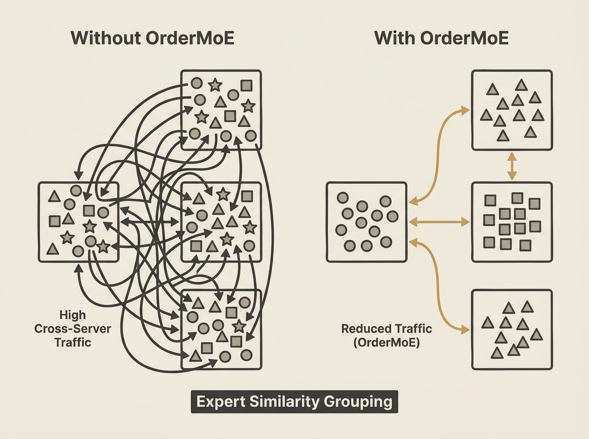

Mixture-of-Experts (MoE) models are powerful, but their deployment on bandwidth-limited edge infrastructure is a challenge.

OrderMoE introduces a novel approach: it recognizes that not all experts are created equal, and some share functional similarities. By constructing an expert similarity model and grouping experts accordingly, it dramatically reduces cross-server token transmission.

This similarity-aware allocation and a quality-aware runtime selection algorithm reduce average and tail latency, cross-server traffic, and remote expert invocation, with only minimal and controllable quality degradation. This is a smart way to get MoE models working effectively at the edge.