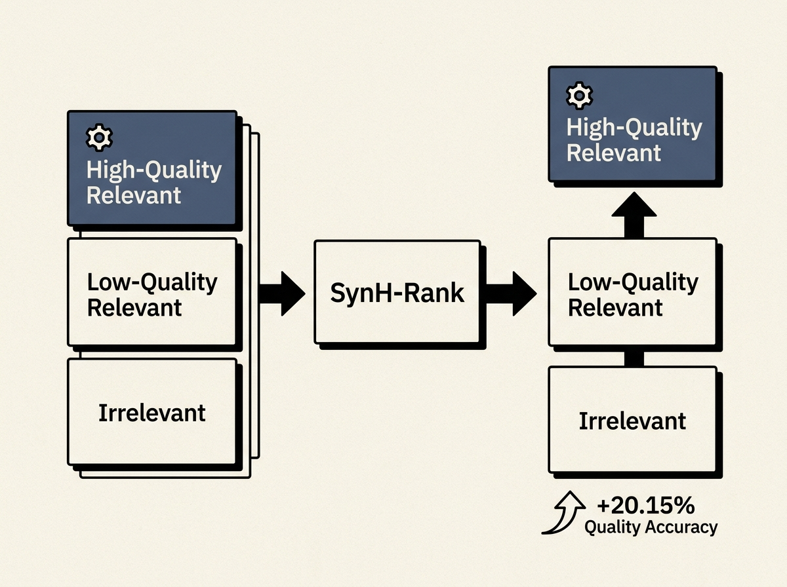

Most code search systems prioritize semantic relevance but completely overlook crucial non-functional qualities like execution speed, memory usage, and maintainability. Developers, however, desperately need high-quality, resource-optimized code.

SynH-Rank tackles this by using LLMs to synthesize diverse, quality-annotated data. It then trains a hierarchical reranker using a three-level labeling scheme: high-quality relevant > low-quality relevant > irrelevant.

This approach improves Quality Preference Accuracy (QPA) by 20.15% over backbone models and outperforms standard relevance-only contrastive training by 15.80%. It is a significant step towards code search that genuinely meets engineering standards.