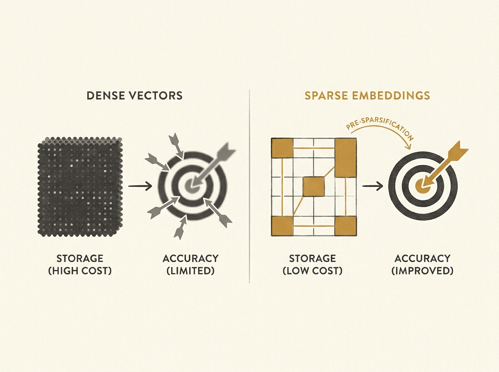

Scaling recommender systems often hits a wall with dense embedding storage and retrieval, especially for cold items that lack historical data. This paper highlights a compelling alternative.

It argues that sparse embeddings have notable advantages over dense vectors for content-based cold-start recommendations. By adapting existing training regimes and introducing a pre-sparsification activation technique, the researchers achieve significant improvements in cold-start accuracy.

Crucially, these sparse embeddings come at considerably lower storage costs and demonstrate robustness, particularly for users with diverse interests. This offers a practical path to more efficient and scalable multimodal recommender systems.

If you are dealing with large-scale embedding storage or cold-start problems, this could change how you approach your architecture.