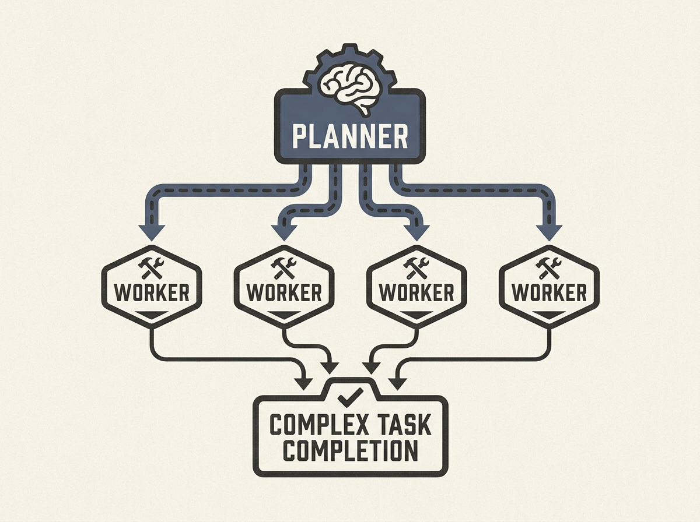

Building complex software with agent swarms is closer than you think. Researchers successfully had an agent swarm build SQLite in Rust from scratch, achieving 80% SQL test suite pass rate in just four hours using Grok 4.5.

The key insight lies in a two-role architecture: "Planner agents" (using smarter, more expensive models) decompose goals, while "Worker agents" (using faster, cheaper models) execute sub-tasks. This tiered approach significantly optimized cost while maintaining quality.

This work offers a blueprint for scaling agentic AI to tackle genuinely hard engineering problems, highlighting how strategic model allocation within a multi-agent system can unlock new levels of capability.
