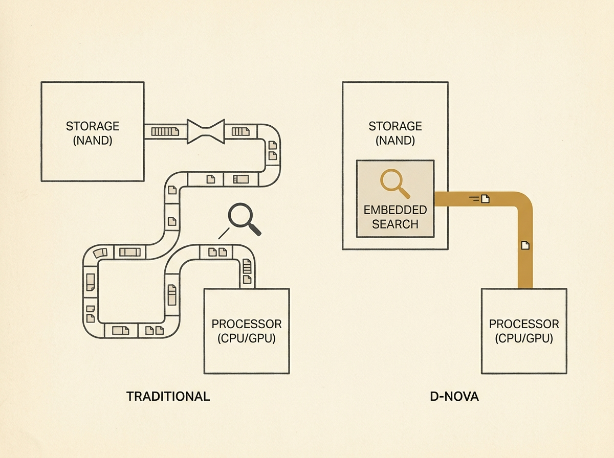

Retrieval-Augmented Generation (RAG) is transforming LLM applications, but dense vector retrieval introduces immense latency and energy overheads. Current in-storage accelerators often fall short by relying on external processors, dedicating up to 70 percent of retrieval time to data movement. D-NOVA directly tackles this bottleneck with a hardware-software co-design that embeds vector search functionality into the NAND memory array itself. It leverages a new distance metric, Dual-Bound Tight Similarity Sensing (DTS), optimized for NAND searches, and a lightweight contrastive adapter to map embedding vectors into a DTS-friendly domain, recovering near-software recall. The results are compelling: D-NOVA achieves up to 41.7x faster performance and 71x greater energy efficiency compared to CPU baselines. It also offers 12.13x higher throughput and up to 1.26x better energy efficiency than state-of-the-art in-storage RAG accelerators. This fully in-storage vector search represents a significant architectural shift, pointing towards a future where RAG performance bottlenecks are decisively overcome. This is crucial for anyone building scalable LLM infrastructure.
