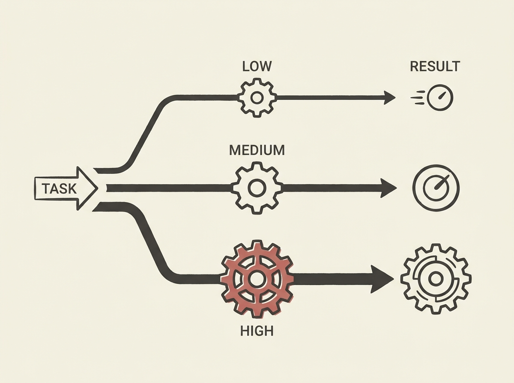

Imagine an LLM that can dynamically adjust how hard it "thinks" based on the complexity of the task. That is precisely what "reasoning effort control" enables, and it is a game-changer for agentic systems.

This article details how to build LLMs with multiple reasoning modes, much like OpenAI's GPT-5.6 family. It means you can choose between low-cost, fast inferences for simple tasks and high-effort, more accurate reasoning for complex problems, optimizing both performance and expenditure.

Mastering this technique is key to building truly intelligent and efficient AI agents.
