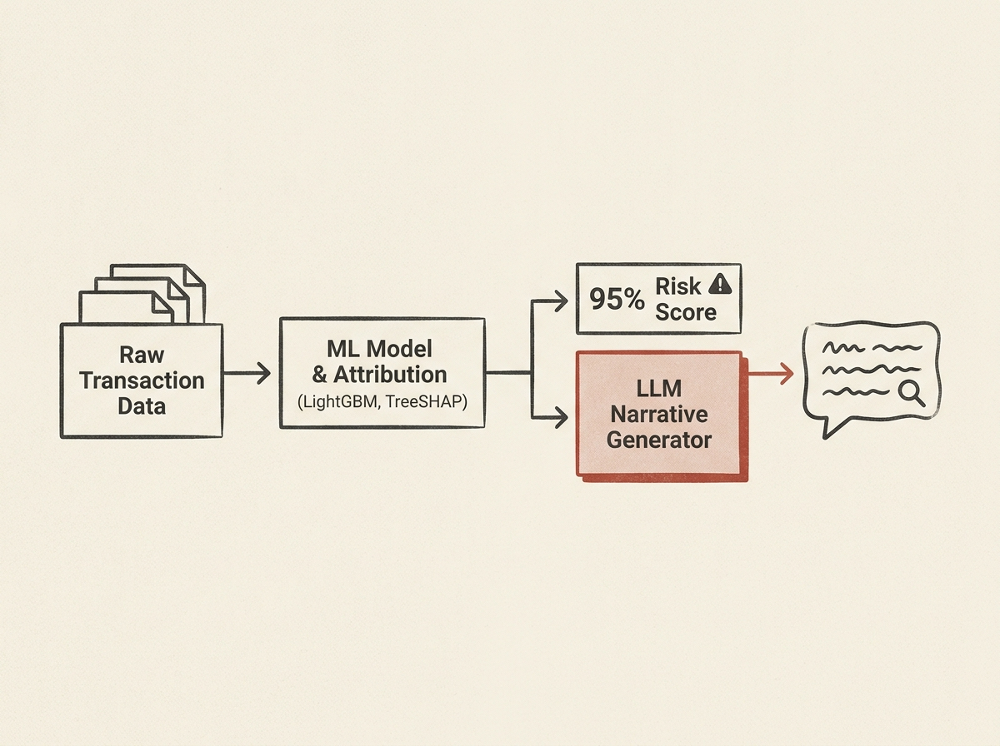

Detecting money mules is a complex financial fraud challenge. This paper reveals a production-grade, end-to-end pipeline that achieved remarkable results in a live deployment. The system combines a LightGBM classifier with 280 engineered features for detection, then uses TreeSHAP for attribution, and finally, an LLM to generate clear, natural-language narratives for analysts. This hybrid approach significantly boosted the yield rate from 61 percent to 89 percent and uncovered 60 percent more adverse detections beyond existing rule-based systems. LLM-generated explanations reduced analyst cognitive load, proving the practical value of integrating advanced AI for explainability in critical financial systems. This is a prime example of applied AI delivering tangible business impact.
