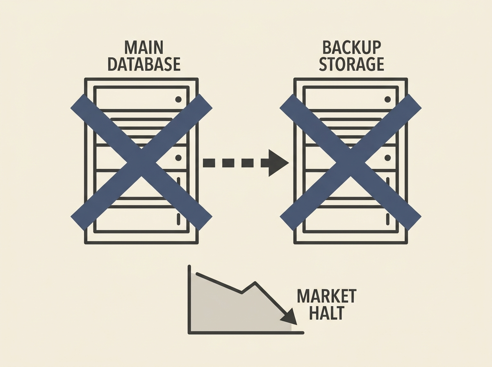

Romania's entire land registry database was wiped clean by a hacker, including its backups. This catastrophic event has completely paralyzed the country's real estate market, demonstrating a fundamental failure in system resilience and data protection.

The incident underscores a crucial lesson for senior engineers: while security breaches initiate such events, the true disaster unfolds due to inadequate database backup and disaster recovery mechanisms. This was not merely a data leak, but a complete data eradication.

Think about your own critical systems. How truly immutable are your backups? Are they logically air-gapped from the primary system? This incident is a harsh reminder that robust, multi-layered data protection is not merely a checkbox, it is the lifeline of any critical service.
