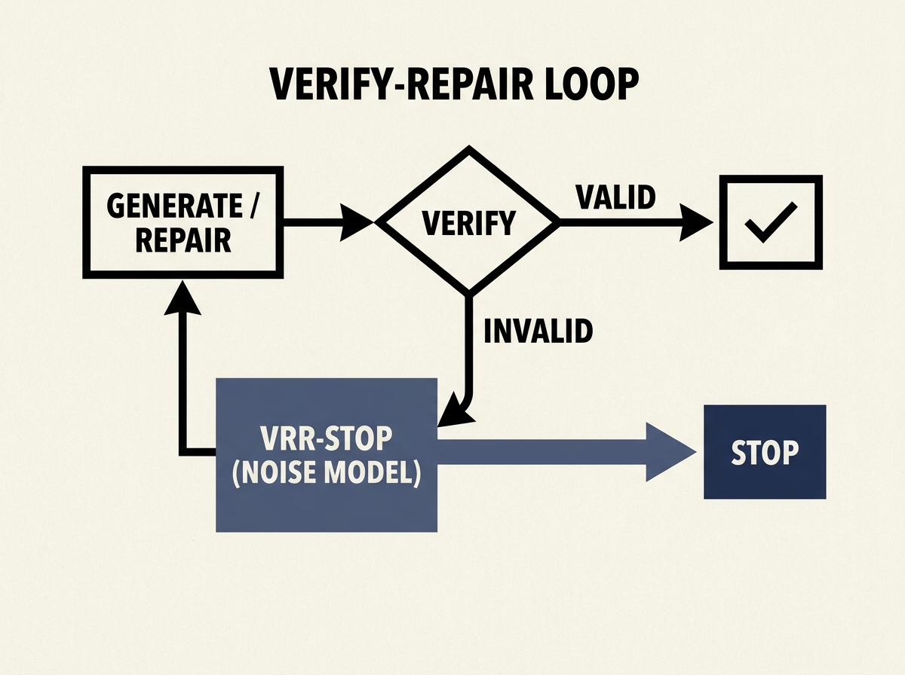

A major headache for building reliable LLM agents is managing verify-repair loops when both the verifier and repairer are noisy. When do you stop trying to fix it?

This paper introduces VRR-Stop, a robust framework that models verifier false acceptance/rejection and repairer damage behavior. It uses belief filtering to estimate validity and a principled decision margin to decide whether to commit, repair, or stop.

On a GSM8K stress setting, VRR-Stop improved final true validity by an astounding 60.6 percentage points over fixed-round repair, at a fraction of the cost. This is a game-changer for practical, robust LLM agent deployment.
