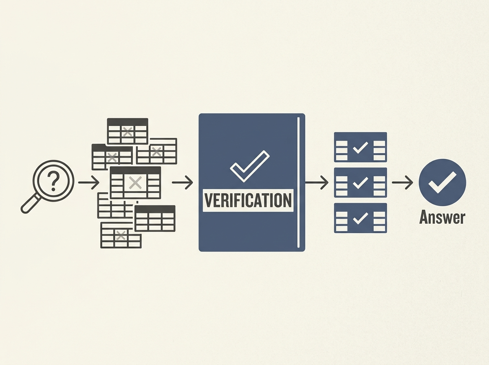

A critical flaw in many RAG systems is that semantic similarity does not always mean a retrieved document actually contains the answer. This is especially true for tabular data, leading to a "Semantic-Answerability Gap."

The paper introduces TCR-Bench, a diagnostic benchmark that reveals a stark drop in QA performance (from 0.755 oracle to 0.330 top-5 retrieved) when dense retrievers struggle to distinguish between semantically similar but logically distinct tables.

The core issues stem from semantic accumulation, schema-level cue dependence, and weak row-column binding. Crucially, a simple two-stage Answerability-Aware Reranking (AAR) pipeline significantly boosts top-1 retrieval from 18.2% to 57.4%.

This highlights that for robust RAG, we need explicit answerability verification beyond just semantic relevance.
