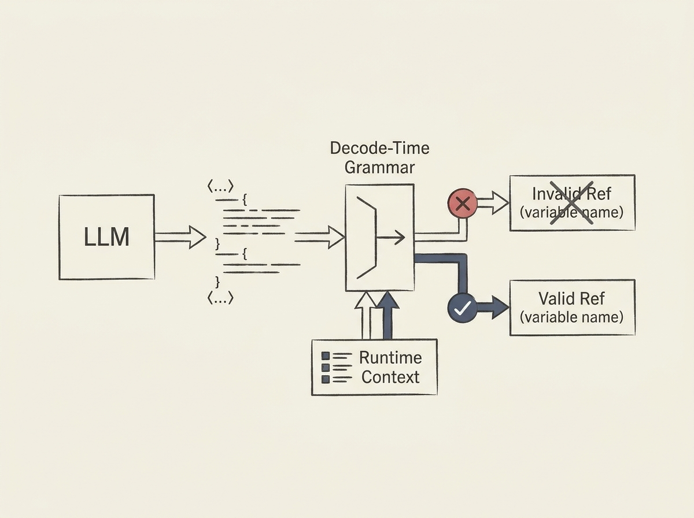

Large language models are increasingly generating code, but they often struggle with semantic correctness, especially for domain-specific languages or custom APIs. The generated code might be grammatically valid but reference undefined symbols, leading to runtime errors.

This paper introduces "decode-time grammars," a powerful solution. Instead of just enforcing grammar, these grammars are instantiated *during generation* from a runtime environment. This means the LLM knows what names, fields, APIs, or options are actually available at a given point in the code.

New declarations enter the environment as they are generated, dynamically refining the grammar for subsequent tokens. This ensures not only grammatical correctness but guarantees that the generated code is semantically valid by construction, eliminating "ghost references." This is a crucial advancement for anyone building reliable AI agents that generate functional code.
