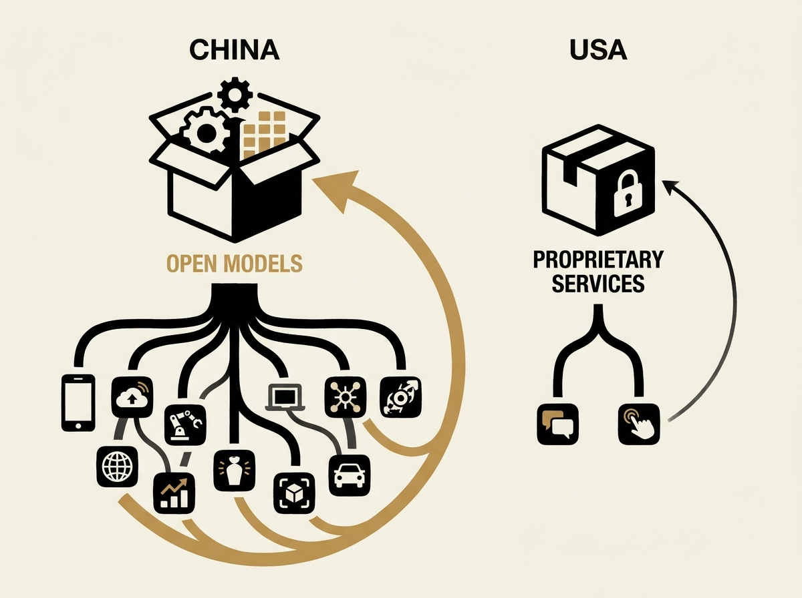

China's open-weights AI strategy is outmaneuvering the US proprietary approach. While American companies lock down models, China is freely distributing its AI, turning a compute disadvantage into a powerful distribution advantage.

The core insight is that AI models, as infrastructure, behave like any other open technology: they are permissionless, portable, and foster more innovation. This commoditizes the model layer, shifting the value to enterprise services and integrations built *around* them.

This strategic play means engineers working with AI should pay close attention. The future of LLM infrastructure may lean heavily towards open-weight models, impacting everything from development choices to deployment strategies. Do not miss this crucial shift.
