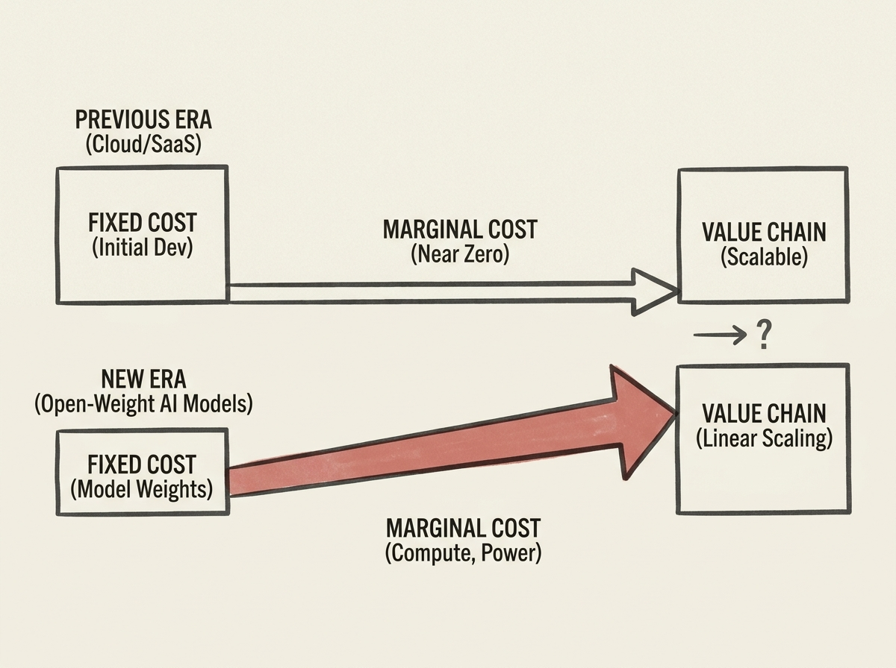

The rise of open-weight AI models, especially from China, is fundamentally reshaping the economics of the tech industry by reintroducing significant marginal costs. This challenges the long-held assumption that software and distribution have near-zero marginal costs.

Historically, this zero-marginal-cost dynamic fueled "Aggregation Theory," concentrating power with platforms. Now, the heavy computational demands and investment required for training and inference, even with open models, bring back a cost-of-goods-sold perspective.

This shift means that while models may be open, their deployment and ongoing operation still carry substantial resource implications. Engineers building AI systems must factor in these renewed cost considerations, moving beyond a purely software-centric view to a more hardware-aware and economically grounded approach.
