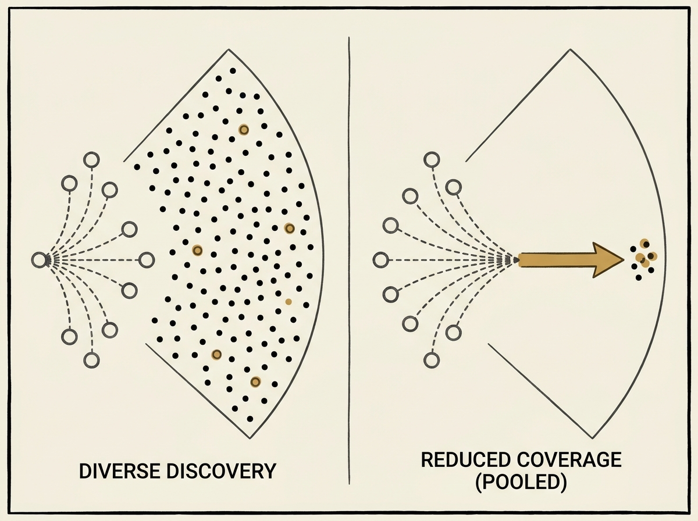

Imagine pooling all your team's knowledge to make the "best" decision, only for the outcome to be worse than if everyone had acted on their private insights. This is the "Shared Discovery Paradox," and it is a critical lesson for multi-agent systems.

This paper models an N-agent search problem, revealing how a "one-answer rule" – where everyone acts on the single best recommendation from pooled information – compresses available actions. This can drastically lower group discovery, even as the accuracy of the single best recommendation improves.

The paradox is a protocol failure, not an information failure. It highlights that simply having better information is not enough; the way that information is translated into collective action is paramount. This insight extends beyond AI agents to organizational design and engineering leadership, showing how rigid decision protocols can stifle innovation and coverage.

Rethink your collective action strategies: sometimes, diversity of action beats consensus.
