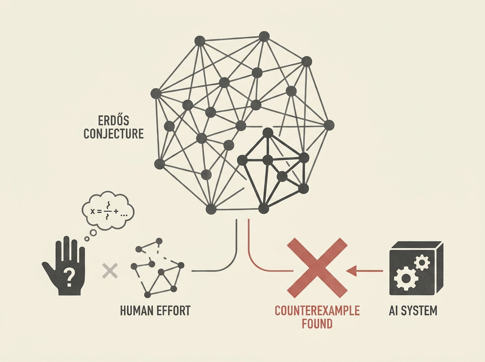

Human mathematicians are now being "outcounterexampled" by AI. This post highlights how systems leveraging LLMs and formal verification tools like Lean are discovering counterexamples to long-standing mathematical conjectures, sometimes within days.

A key example is ChatGPT disproving Erdős’ Unit Distance conjecture. Crucially, this was then autoformalized in Lean by Logical Intelligence, bridging the gap between LLM-generated insight and rigorous, machine-verifiable proof.

This development is a strong signal for engineers focused on AI agents and LLM reasoning. It shows the immense potential of integrating LLMs with formal systems, not just for scientific discovery, but for building more robust, verifiable, and intelligent agents across various domains.
