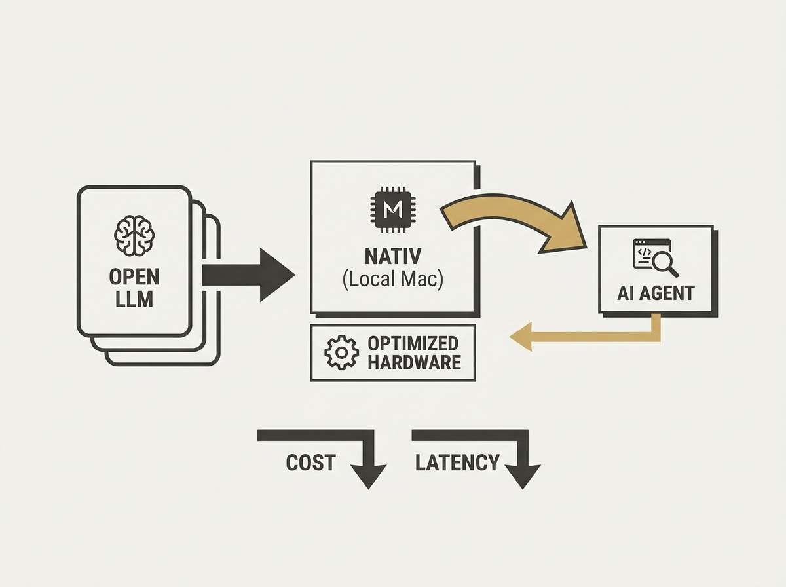

Running frontier AI models locally on your Mac is now much more efficient with Nativ. This tool is specifically optimized for Apple Silicon, leveraging M-series unified memory and Metal for high performance without cloud dependencies or subscriptions.

Nativ focuses on enabling a seamless local experience, which is crucial for developers working with AI agents where privacy, cost, and latency are key. It allows integration with existing coding agents by handling the local model endpoint, streamlining development workflows.

This kind of optimized local infrastructure is a game-changer for iterating quickly on agentic AI projects.
