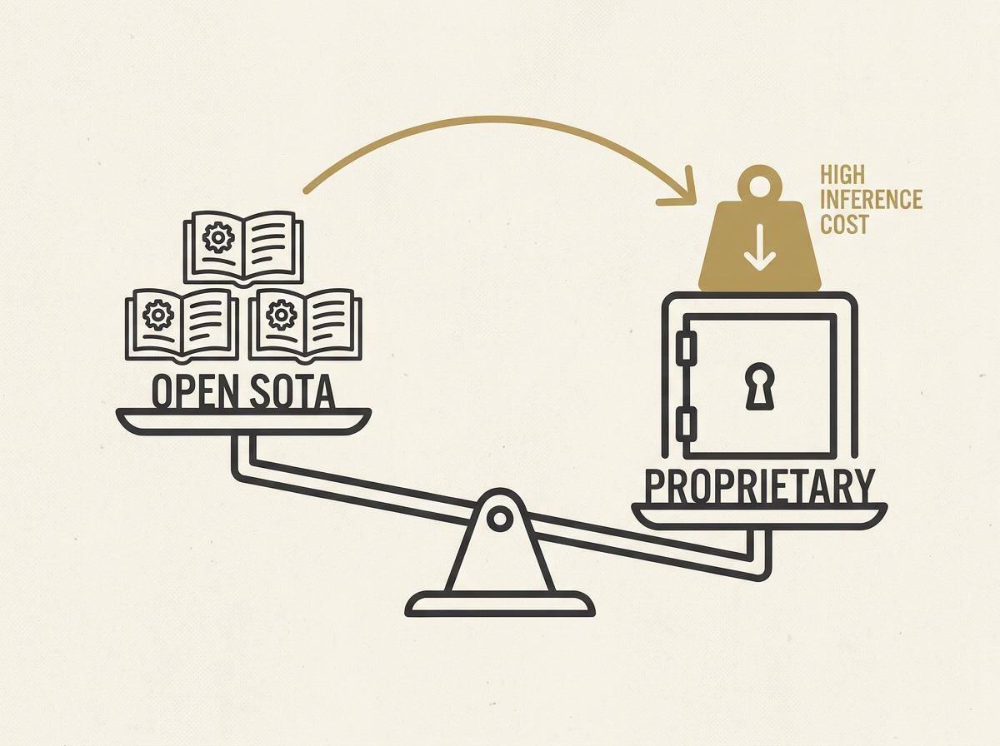

The emergence of Moonshot Labs' Kimi K3 and Alibaba's Qwen 3.8, both allegedly close to Anthropic's Fable 5, is fundamentally reshaping the economics of foundation models. These open models are poised to release their weights publicly, posing a significant challenge to top-tier proprietary model developers.

This shift highlights that achieving state-of-the-art performance is increasingly possible with open models, changing the calculus for LLM infrastructure and applied AI. The article dives into how crucial inference costs (compute and electricity) are for running an LLM business, pushing vendors to own more of the value chain.

Understanding these economic dynamics is vital for any senior engineer designing scalable AI solutions.
