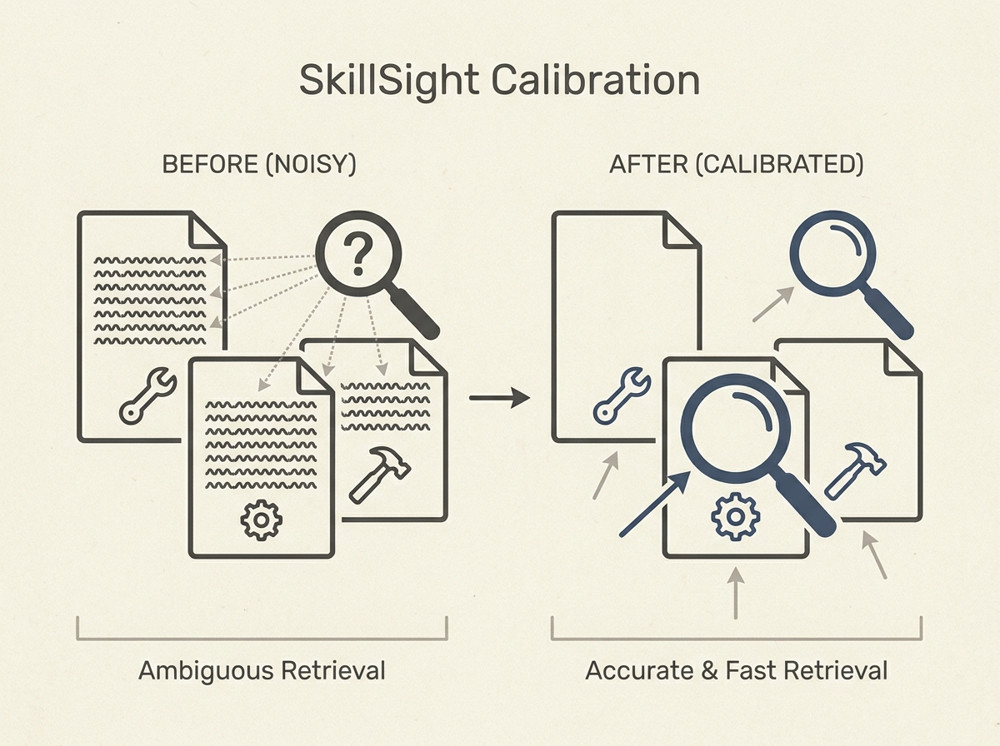

LLM agents often falter not from lack of skills, but from poor skill retrieval. The problem? Shared descriptive patterns in skill libraries create noise, making it hard for retrievers to pinpoint the right tool.

SkillSight, a new training-free framework, tackles this by calibrating shared background in both semantic and lexical spaces. It improves Recall@10 by up to 20.21 percentage points and is 1,248 times faster than Dense + Reranker baselines.

This is a critical step towards truly capable and efficient agentic systems.
