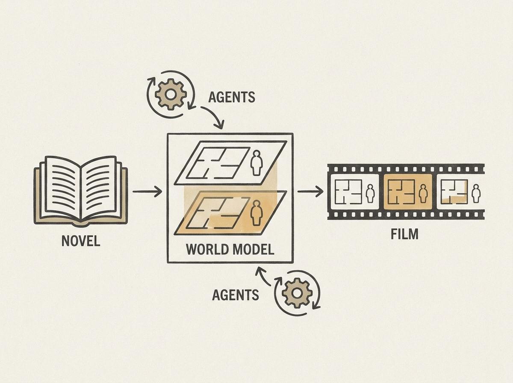

Generating coherent, long-form visual narratives from text is an immense challenge for AI. FilmWorld introduces a breakthrough agentic system that translates entire novels into films, far beyond single-scene video clips.

This system leverages specialized agents that collaborate to construct and evolve a "cinematic world model." One group of agents focuses on narrative translation, world entity state modeling, and shot planning. Another ensures dynamic state propagation and causal consistency across diverse scenes, a critical yet often overlooked aspect in generative AI.

Maintaining consistency over hours of content is a monumental feat, and FilmWorld's agent-based approach with explicit state modeling and verification offers deep insights into designing complex, multi-agent generative systems. This demonstrates a significant step towards truly autonomous content creation at scale.
