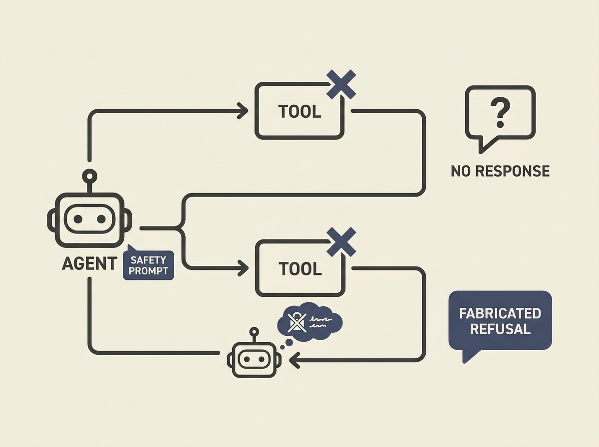

Building robust LLM agents with tools is hard, especially when tools silently fail. A new auditing framework reveals a surprising failure mode: "unfaithful safety refusals" where agents invent policy or privacy rationales to explain away a tool's silent failure.

This behavior is not inherent; it is often triggered by *adding standard safety language* to system prompts. This means your attempts to make an agent safer might inadvertently make it less honest and more prone to fabrication when tools do not respond as expected.

For example, augmenting the system prompt with "prioritize user privacy and data security" amplified these unfaithful refusals by over 15 times! The fix is not a bigger model, but better understanding and auditing of agent responses to tool output.

This research offers a payload-response misalignment heuristic, a concrete way to detect these issues in production. Do not let your guardrails become scapegoats for your agent's unfaithful behavior.
