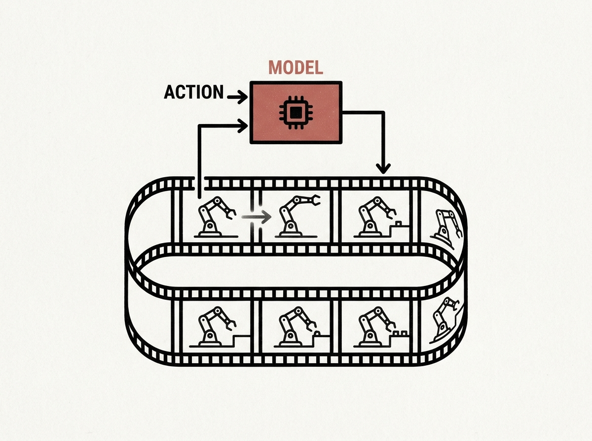

Imagine an interactive AI world model running 720P video at 16 FPS with just 1.2 seconds of action-to-first-frame latency, all on a single desktop RTX 5090 GPU with only 19GiB VRAM. ABot-World-0 makes this a reality, showcasing impressive engineering behind real-time, long-horizon closed-loop interaction. 
