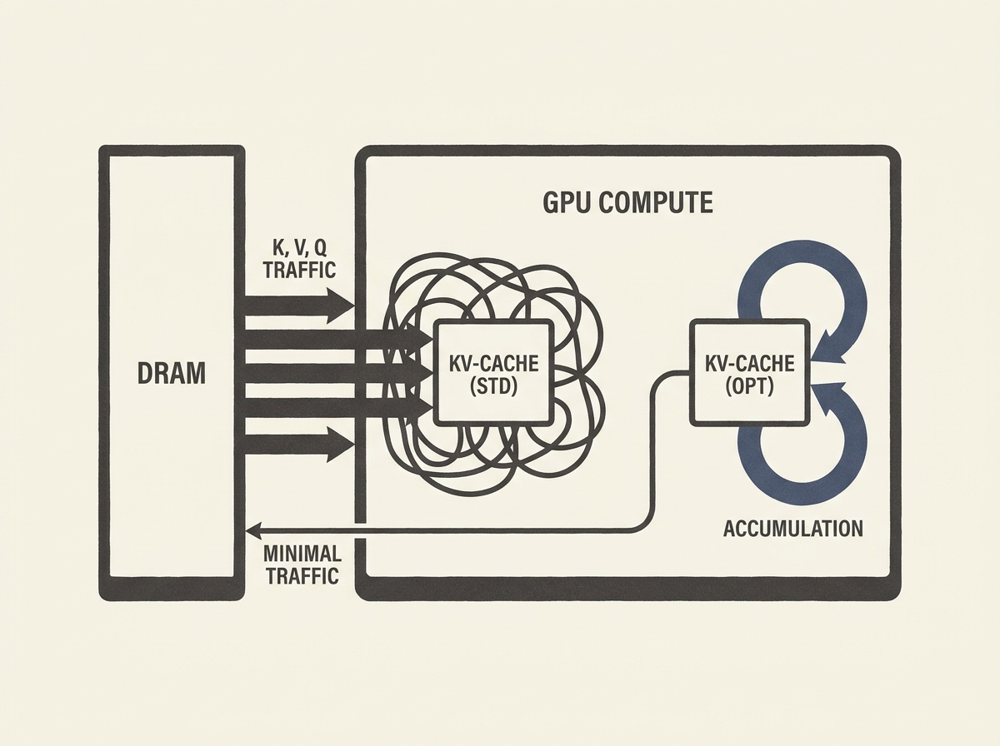

Optimizing transformer inference is critical for practical LLM deployment, and this paper delivers fundamental insights. It mathematically derives four memory-optimal artifacts for attention mechanisms, leading to significant DRAM traffic reductions.

One key takeaway is a single-query decode DNF that algebraically eliminates the K^T buffer, drastically cutting memory usage. Additionally, it details a C/OpenACC GPU kernel designed for hardware-coalesced memory access and an O(d_k+d_v) per-step KV-cache append.

For anyone building or operating LLM infrastructure, understanding these rigorous optimizations for GQA/MQA and KV-cache accumulation is essential for cost-efficiency and performance at scale.
