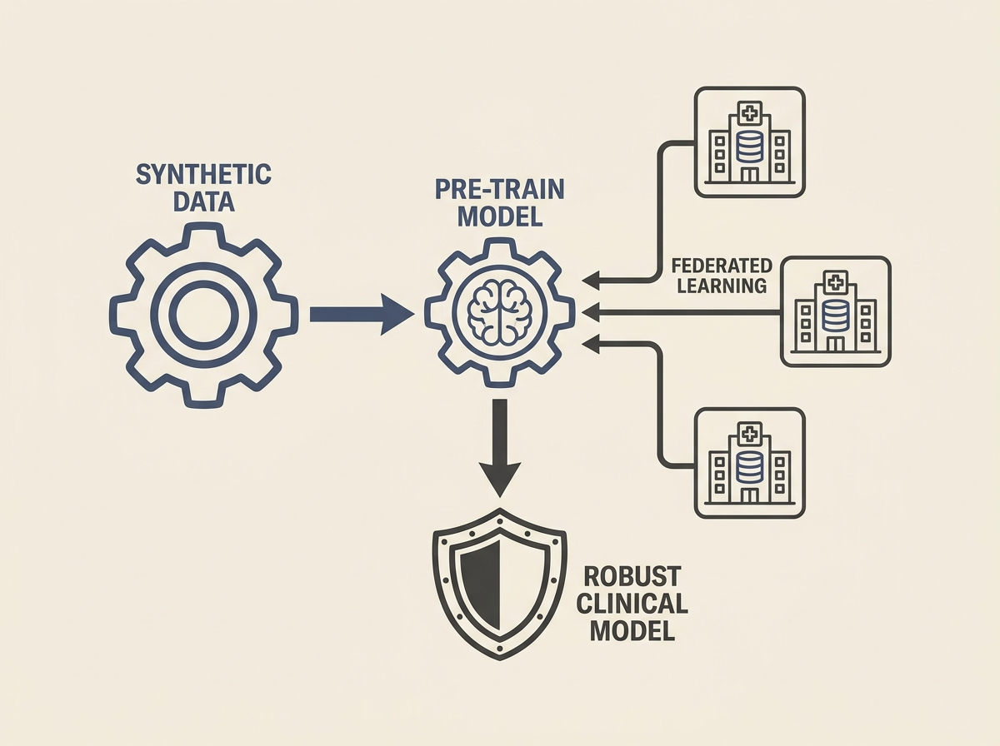

Federated Learning faces tough challenges like data scarcity and client heterogeneity. This paper introduces SynPre-FL, a framework that smartly uses synthetic data generation to pre-train FL models, making them more robust and scalable.

The approach starts with a latent autoencoder-diffusion model to generate privacy-preserving synthetic cohorts. This synthetic data then "warm-starts" federated training, which is a clever way to bootstrap performance before real, distributed data is used.

Experiments show this method significantly improves robustness, especially under severe non-IID data fragmentation, outperforming baselines. This offers a practical pathway for privacy-aware, interpretable, and robust clinical prediction, and the concepts are applicable beyond healthcare.

This is a solid example of solving hard distributed ML problems with applied AI.