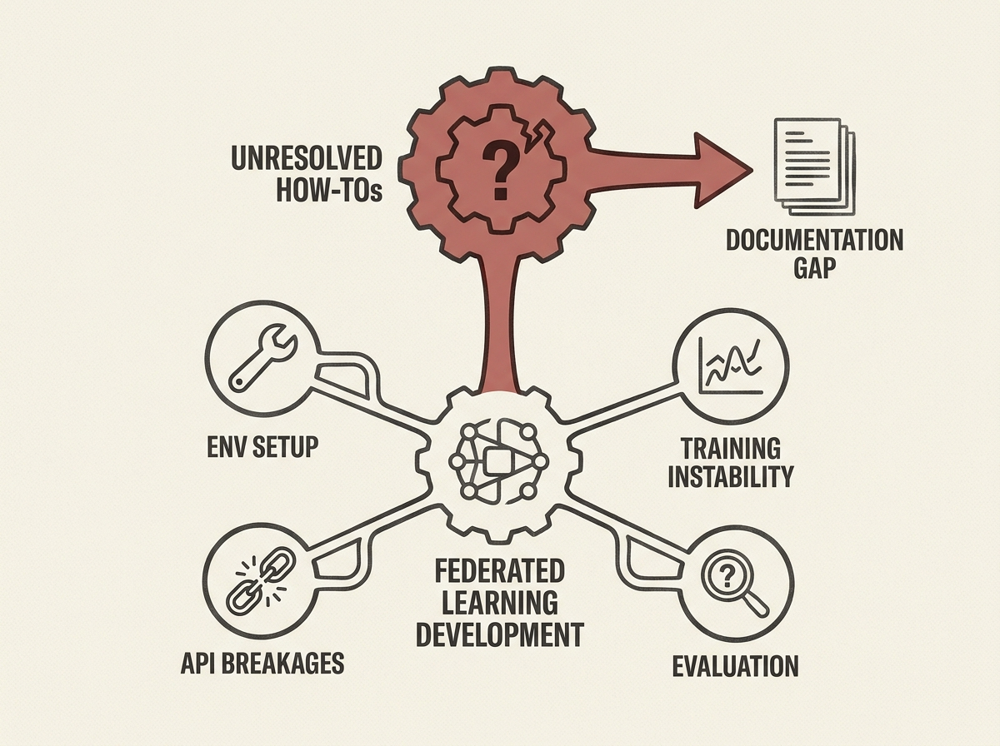

Building Federated Learning systems is notoriously difficult, but where exactly do developers struggle most? A recent empirical study analyzed thousands of Stack Overflow posts and GitHub issues to pinpoint the most persistent pain points.

They found recurring challenges in environment setup, API breakages, training instability under non-IID data, and evaluation correctness. A surprising finding was the high rate of unresolved "How-to" questions, pointing to significant documentation and tooling shortcomings.

These insights are gold for anyone designing distributed AI systems. Understanding these common pitfalls helps you anticipate problems and build more usable, reliable systems from the ground up.