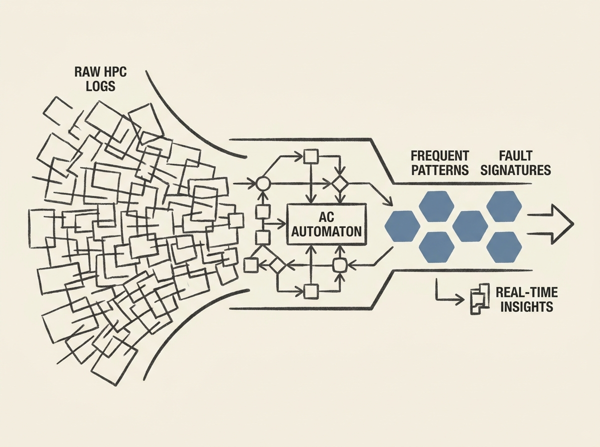

Modern supercomputers churn out astronomical volumes of log data daily, making traditional analysis techniques obsolete. This paper presents a scalable pattern mining workflow designed specifically for High-Performance Computing (HPC) environments. It leverages advanced pattern-matching and mining, storing frequent log patterns and sequences in an Aho-Corasick automaton. This enables automated detection of frequent errors and fault events, and even correlates them with job logs to reveal application-specific error signatures. The result is real-time analysis that informs system improvements and guides monitoring efforts, making HPC systems more resilient and scalable.