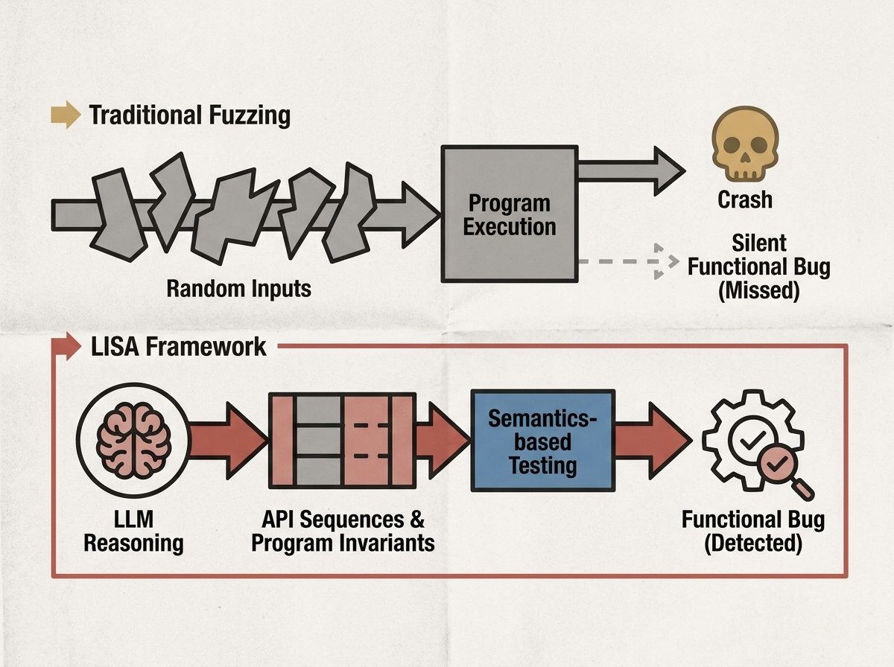

Manually writing unit tests is tedious, and traditional fuzzing often misses functional bugs that do not crash the system. LISA, a new LLM-based invariant testing framework, offers a powerful alternative. It iteratively generates API sequences and program invariants by reasoning about program semantics, something heuristic methods cannot do. This approach achieves higher bug-detection rates and competitive code coverage compared to both fuzzing and prior LLM-based test generation techniques. It represents a significant step forward in leveraging AI for more intelligent and effective software quality assurance.