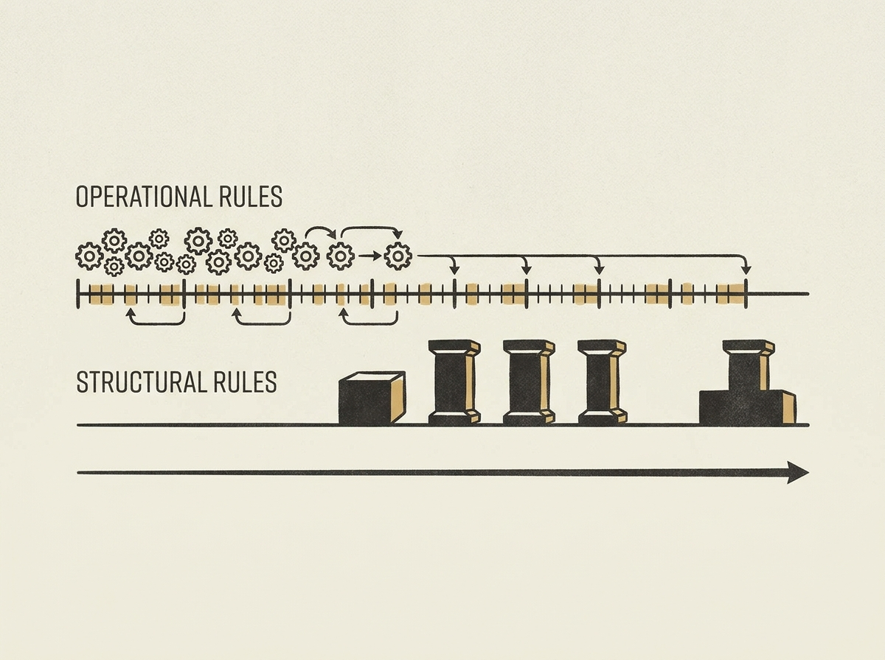

Managing large, mature open-source projects, especially deep learning frameworks with diverse contributor bases, presents substantial coordination challenges. What rules really matter, and when should they be introduced?

An empirical study of PyTorch, TensorFlow, and Paddle analyzed over 100 governance documents and 1,700 commits. It found that operational rules (like workflows) appear earlier and are revised more frequently, while structural rules (like role hierarchies) emerge later and change less often.

The paper synthesizes these findings into 33 actionable governance practices. This is invaluable for maintainers of any large-scale OSS project seeking systematic guidance on codifying rules, organizing documentation, and fostering healthy collaboration and quality control. It is a deep dive into the 'how' of successful open-source management.