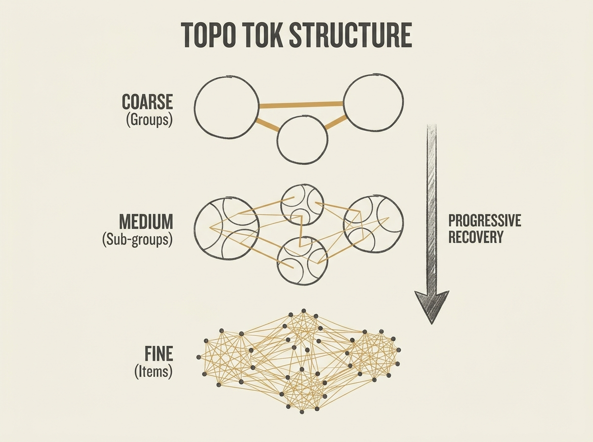

When we tokenize items for generative recommendation, a subtle but critical problem often arises: 'topology distortion.' The intrinsic relationships between items in their original semantic embedding space can be significantly disrupted during quantization.

This distortion misleads models about item similarity, ultimately bottlenecking generative recommendation accuracy. This paper introduces Topology-Aware Tokenization (TopoTok), a multi-level distillation framework that actively preserves item relational structure throughout the quantization hierarchy.

TopoTok uses inter-group, intra-group, and inter-item distillation to progressively recover topology from coarse to fine granularity. This approach consistently outperforms state-of-the-art tokenizers, achieving performance gains of up to 9.42% in Recall@5. It is a crucial advancement for anyone working with embeddings and generative models, especially for RAG systems where semantic preservation is paramount.