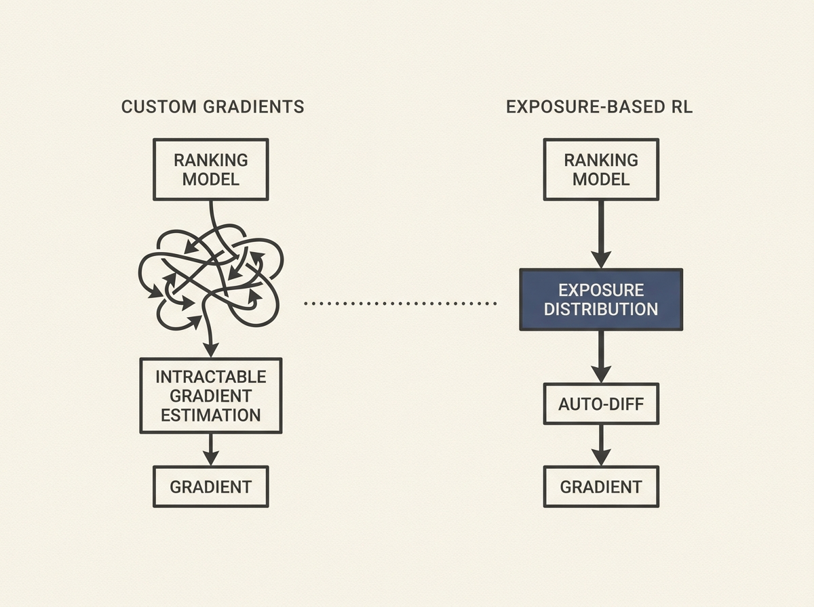

Reinforcement learning (RL) for learning-to-rank (LTR) can optimize almost any ranking goal, but its complexity and computational cost often deter practitioners. Existing methods rely on intricate custom gradient computations that clash with auto-differentiation.

This paper rethinks RL for LTR, proposing an exposure-based approach that sidesteps custom gradients. By focusing on variance reduction and GPU computation, and using baseline corrections and partial marginalization, it achieves high sample-efficiency and numerical stability.

Crucially, it introduces an abstraction that places gradient estimation behind a document-exposure distribution, allowing seamless plug-and-play integration with auto-differentiation. This method converges considerably faster and achieves significantly higher ranking performance than existing custom gradient techniques, making RL for LTR much more accessible and effective for real-world applications.