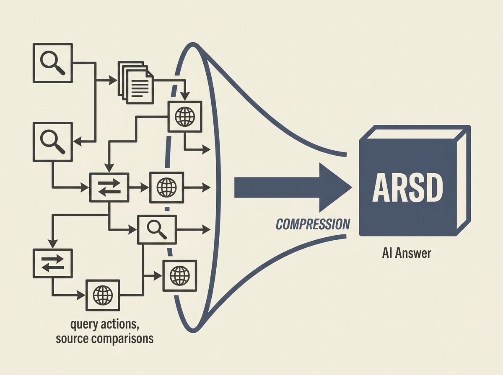

How do you truly measure the value of a conversational AI or RAG system? Existing metrics often miss the crucial aspect of "search work" saved. This paper introduces Answer-Reconstruction Search Density (ARSD) to fill that gap.

ARSD quantifies the minimum distinct query actions needed to reconstruct the information provided in a synthesized answer, under a fixed policy. Think of it as measuring how much manual searching, cross-referencing, and source comparisons the AI is saving a human.

This metric offers a new lens for engineers and product managers to understand the true efficiency and "compression" power of their conversational systems. It moves beyond simple factual correctness to evaluate the cognitive load reduction.

For anyone building or evaluating RAG or agentic AI, understanding and applying such metrics is key to optimizing user experience and demonstrating real value.