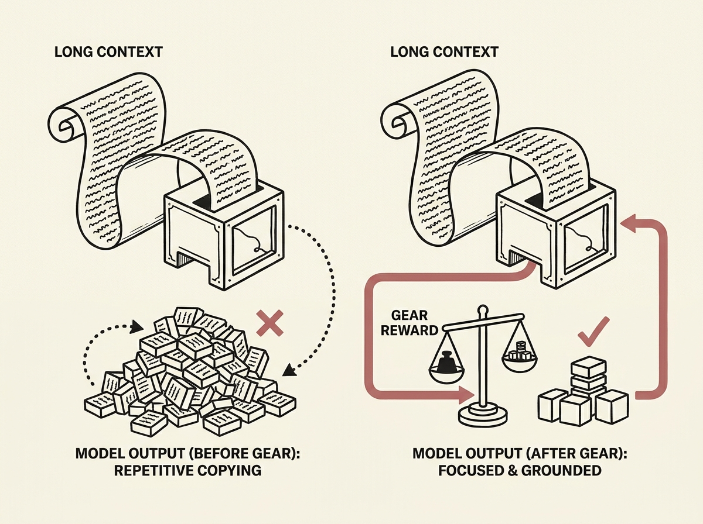

Long-context LLMs often suffer from a critical failure mode: repetitive copying, where they extensively copy input text instead of productively solving the problem. This behavior is pervasive and worsens with longer contexts, leading to insufficient grounding.

This paper proposes GEAR (Grounding Evidence-Aware Reward), a reward shaping method that augments accuracy signals with a grounding reward for relevant evidence and a penalty for irrelevant context. This encourages models to focus on key information.

To enable GEAR, the team developed an automated pipeline for creating evidence-annotated training data from arbitrary documents. This practical approach yielded consistent improvements of up to +4.6 average points over standard RL, with even larger gains at longer contexts.

Crucially, GEAR also reduced repetitive copying and the overall "thinking length" of the models. This demonstrates that improving how LLMs ground their responses in relevant evidence is indispensable for advancing their long-context reasoning capabilities.
