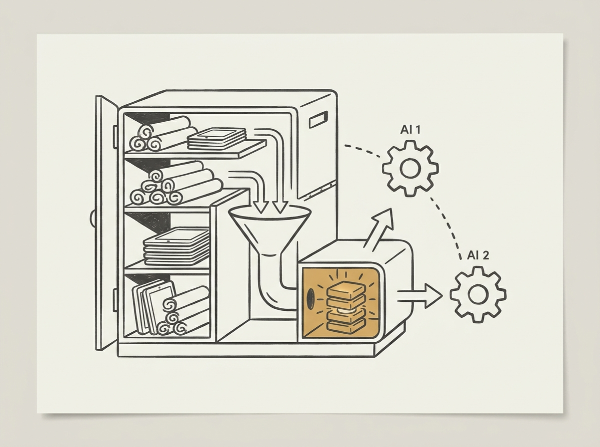

Traditional self-improving AI systems often tie improvements to specific agent designs or workflows, making them costly and hard to transfer. This paper challenges that with a 'knowledge-centric' paradigm.

Instead of improving the agent, the focus shifts to curating a persistent knowledge base. Agents contribute evidence-grounded insights to this shared knowledge, which is then distilled. The agents themselves remain generic and disposable.

This approach significantly improves task solve rates while reducing dollar cost, and crucially, the distilled knowledge transfers effectively to new tasks and even across different LLM families. This indicates a more robust and scalable form of improvement.

This is a powerful new way to think about building generalizable and cost-effective AI agents, offering key insights for designing future agentic systems.
