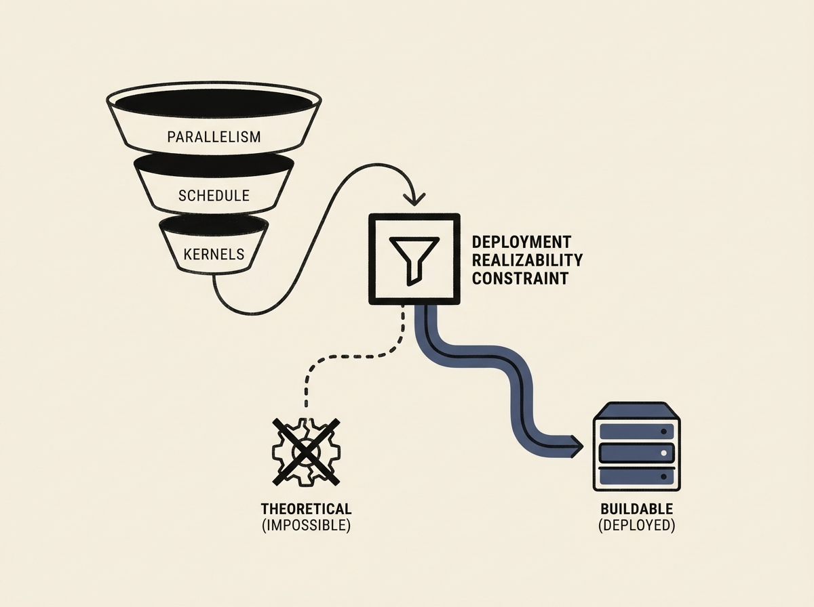

Optimizing Mixture-of-Experts (MoE) models often results in plans that are theoretically perfect but practically impossible to deploy. A new optimizer, 'moefs', tackles this by making deployment realizability a first-class constraint in its search.

This system closes a three-tier search over parallelism, schedule, and kernels. It directly integrates with production stacks like Megatron for training and SGLang for serving, demonstrating that a 'buildable' plan can match or even slightly edge out hand-tuned baselines.

This is a game-changer for LLM infrastructure, directly solving the disconnect between theoretical optimization and real-world engineering constraints in large-scale AI deployments.