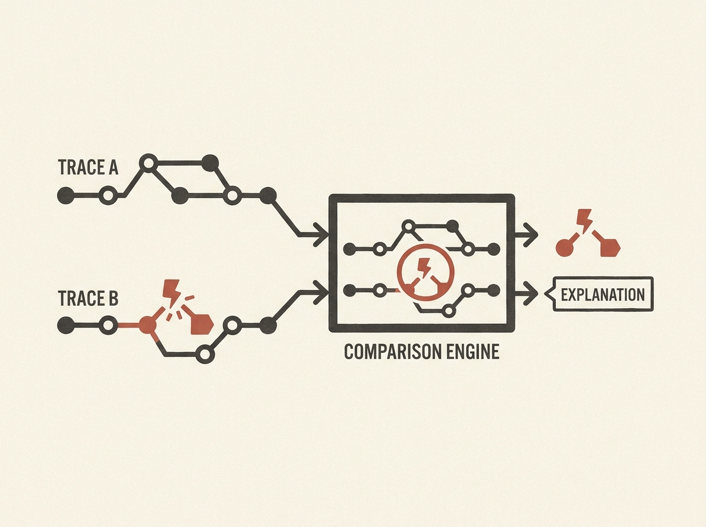

Diagnosing distributed system anomalies is fundamentally a comparison task, yet current tools fall short across multiple dimensions. Contrast introduces the Trace Projection Object (TPO), a game-changing mergeable representation that captures structural, temporal, critical-path, and semantic properties of trace populations. This allows for efficient, dynamic comparison sets. The system also integrates LLMs to generate natural language explanations of trace differences, making complex system behavior far more interpretable. Evaluated on production traces from Uber, Contrast significantly improves on diagnostic effectiveness and efficiency.