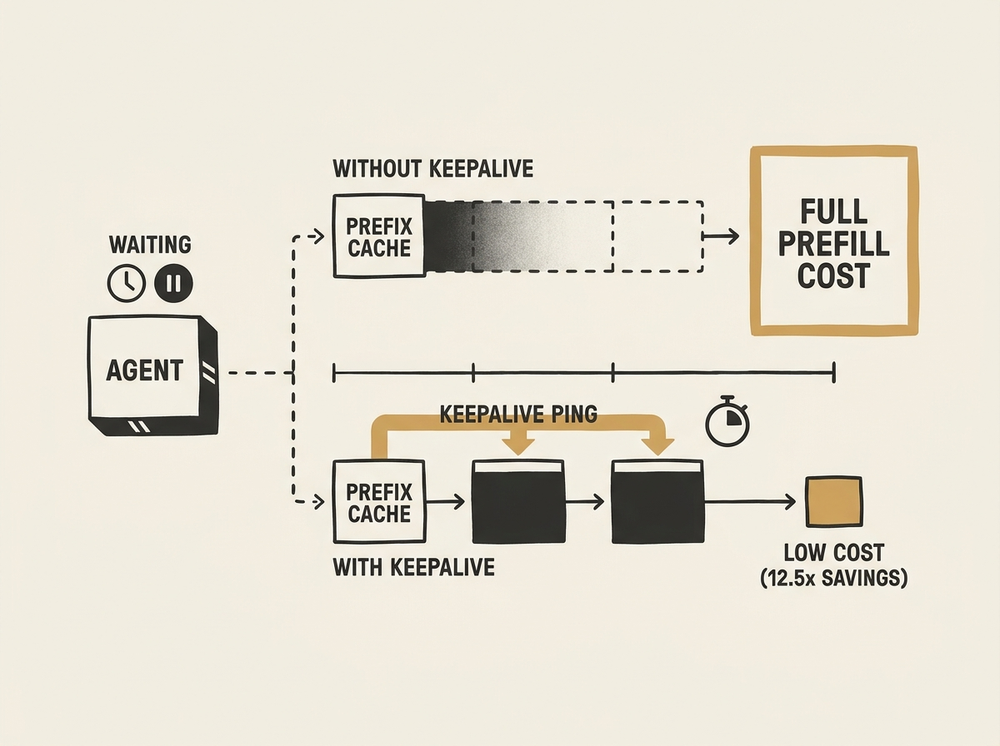

Agentic workloads often inadvertently destroy the cost and latency benefits of LLM prefix caching. This paper reveals that when an agent pauses (e.g., waiting for tool execution or human approval), the cached prefix is often evicted, forcing a full prefill cost on the next request. A simple client-side keepalive, replaying the prefix on a timer, prevents this. The economic analysis is compelling: keepalives can cut post-pause request costs by up to 12.5x across major providers like Anthropic, OpenAI, Google, and DeepSeek. The optimal keepalive interval is the largest one safely under the provider's TTL (around 4 minutes for Anthropic's 5-minute TTL), breaking even against a full re-prefill at around 36-46 minutes of idle time. This is a must-read for anyone building agentic systems; it is a straightforward optimization with massive cost implications, and it might even push providers to rethink how they meter cache residency.