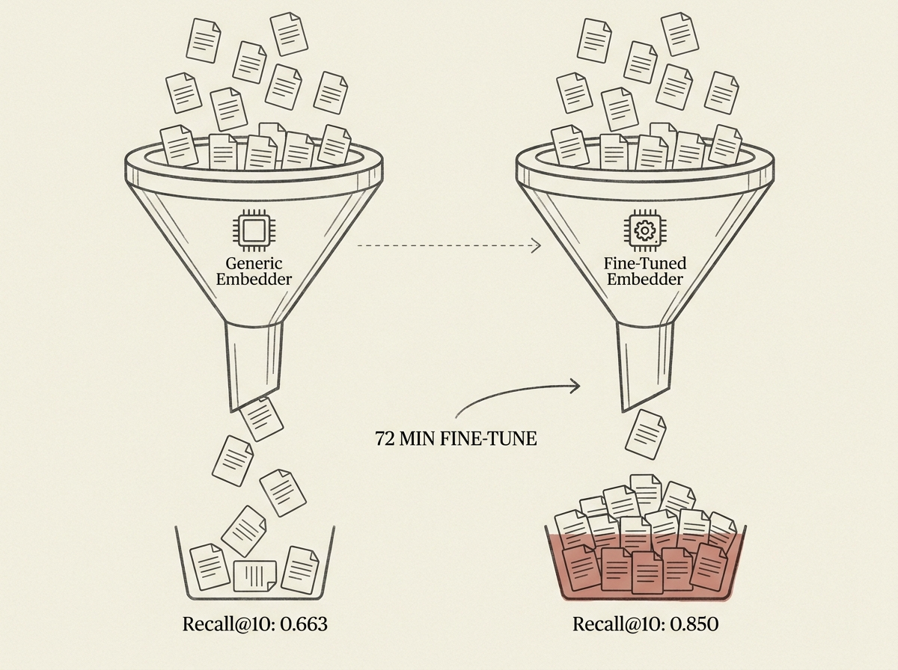

Building production-ready RAG systems under strict data privacy and resource constraints is a monumental challenge. Imagine 'zero data egress' and only an 8GB consumer laptop for development.

RAGAL, a retrieval-augmented assistant for a government agency, shows it is possible. This project prioritized retrieval engineering and embedder fine-tuning over chasing larger generators, boosting internal evaluation from 62% to 81%. Fine-tuning the bge-m3 embedder on real ticket data improved recall@10 from 0.663 to 0.850 in just 72 minutes.

Crucially, they discovered that PII masking surprisingly improved generation quality and devised a 'structural anchor distillation' scheme that eliminated SQL hallucination by design. This work offers a reproducible recipe for fully local, high-performance RAG, proving that smart engineering can overcome severe limitations.