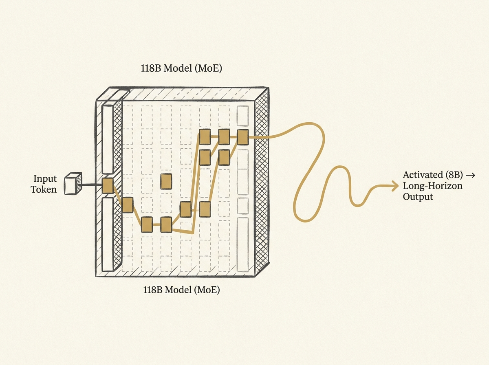

---
authors:
- rexledesma
comments: https://news.ycombinator.com/item?id=48995261
date: '2026-07-21'
hn_id: '48995261'
image: 24-hn-48995261-infographic.png
interest_score: 8
section: ai
source: hn
tags:
- catchup
- coding-benchmarks
- hn
- laguna-s-2.1
- long-horizon-reasoning
- mixture-of-experts
- model-evaluation
title: Laguna S 2.1 excels at long-horizon coding and reasoning
url: https://poolside.ai/blog/introducing-laguna-s-2-1
why_read: This announcement introduces Laguna S 2.1, a new Mixture-of-Experts model
  notable for its ability to handle long-horizon coding tasks and reasoning effectively.
  Readers will learn about its architecture, rapid development, and strong performance
  against larger models on various benchmarks.
---

Achieving high performance on complex, long-horizon AI tasks does not always require massive, monolithic models. Poolside.ai's new Laguna S 2.1, an 118B Mixture-of-Experts (MoE) model, stands out by supporting a 1M token context window while using only 8B activated parameters per token.

This model, developed in under nine weeks, demonstrates competitive performance on demanding coding benchmarks like DeepSWE and SWE-Bench Multilingual, even against models many times its size. This efficiency is critical for deploying AI agents effectively.

The team emphasizes its capability for "longer horizon work and effective use of reasoning," which is a key challenge in agentic AI. The detailed evaluation methodology, including the release of full trajectories, sets a high standard for transparency in model development.

This showcases a pragmatic approach to building powerful, yet efficient, LLMs for practical applications.