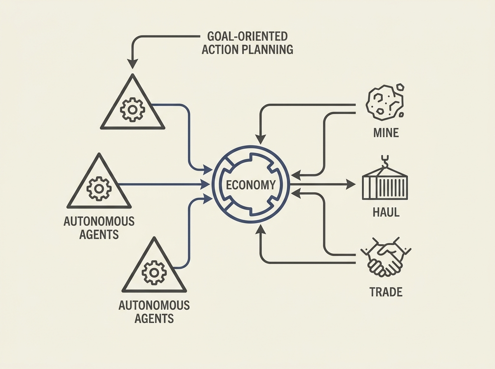

---
authors:
- Kalcode
comments: https://news.ycombinator.com/item?id=48996187
date: '2026-07-21'
hn_id: '48996187'
image: 28-hn-48996187-infographic.png
interest_score: 8
section: ai
source: hn
tags:
- 3d-client
- autonomous-agents
- bevy
- catchup
- economic-simulation
- goap
- hn
- native-binary
- rust
- space-economy-simulation
title: The Space Project is a self-running space-economy simulator
url: https://github.com/Kalcode/spaceprojectsim
why_read: This description details a complex, agent-driven space-economy simulator
  built with Rust and Bevy. It offers insights into autonomous agent design and economic
  simulation principles for those interested in game development or system design.
---

An open-source space economy simulator built with Rust and Bevy features hundreds of autonomous agents (ships), each with its own GOAP planner. These agents dynamically trade, mine, haul cargo, and manage their resources within a living solar economy.

This project is a fantastic real-world example of multi-agent systems in action, demonstrating how goal-oriented action planning can drive complex emergent behavior. It showcases practical application of agentic AI for simulating complex systems, far beyond theoretical concepts.

For engineers interested in AI agents and high-performance system design, this is a deep dive into building scalable simulations. You can observe how individual agent decisions, driven by their goals and environment, lead to a self-organizing economy. It is a compelling example of applied AI engineering.