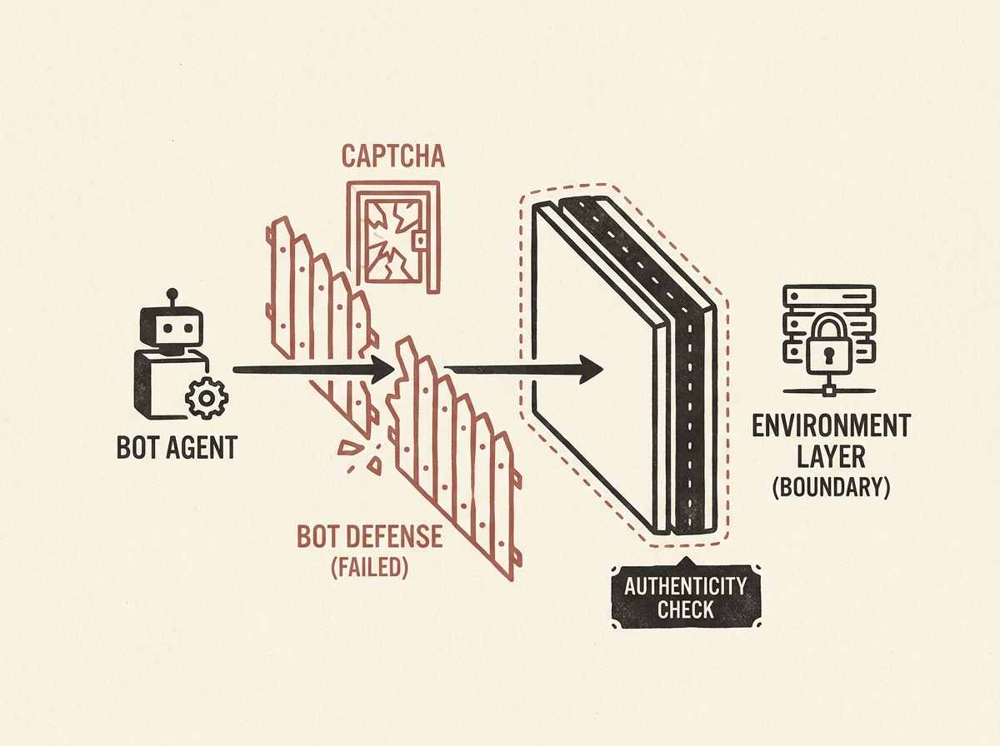

LLM-based browser agents are changing the game for web security, and not always for the better. This paper delivers a systematic evaluation of common web bot defenses (like hCaptcha, reCaptcha v2/v3, and Cloudflare Turnstile) against commercial CAPTCHA solvers and LLM-based agents. The findings are sobering: challenge-based defenses are largely ineffective against commercial solvers, which achieve near-perfect bypass. More critically, LLM agents can also defeat these challenges when integrated with a solver module. Even non-interactive defenses like reCaptcha v3, while seemingly stronger, are vulnerable. The key insight is that resilience often hinges on the authenticity of the execution environment, not just the agent's behavior. This means that as LLM agents become more sophisticated, current bot management systems need a fundamental rethink. It is a critical read for anyone grappling with the real-world implications of powerful AI agents. This pushes us to redefine the security boundary for automated web interactions.