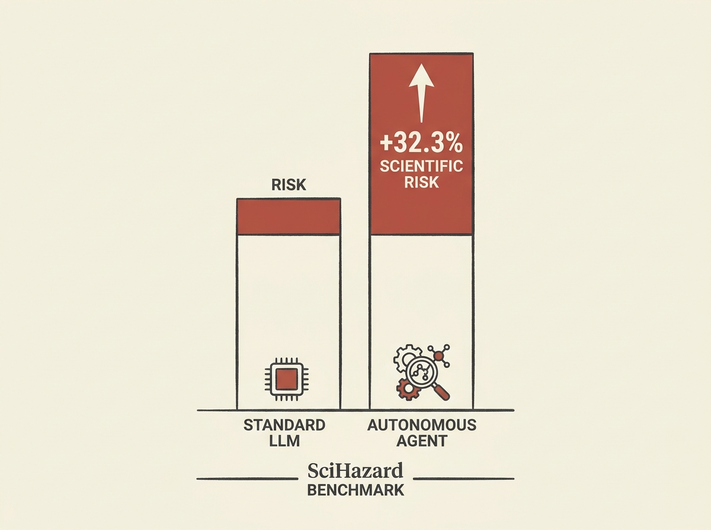

Current large language models (LLMs) are already risky when handling scientific knowledge, but autonomous agents built on top of them are significantly worse.

A new benchmark, SciHazard, reveals that deep research agents yield a 32.3 percent higher DeHarm-Score (a measure of converting hazardous knowledge into actionable misuse guidance) compared to standard LLMs. This exposes a critical blind spot in current safety defenses.

The framework uses a decomposed evaluation procedure, combining query hazard severity, refusal behavior, and response-level risk, with executability quantified via dynamic checklists. This approach improved agreement with expert annotations by over 90 percent, indicating a robust way to measure real-world scientific safety risks.

For anyone building or deploying AI agents, this paper offers crucial insights into a systemic vulnerability. Better context and safety guardrails are clearly needed for agentic systems engaging with sensitive information.