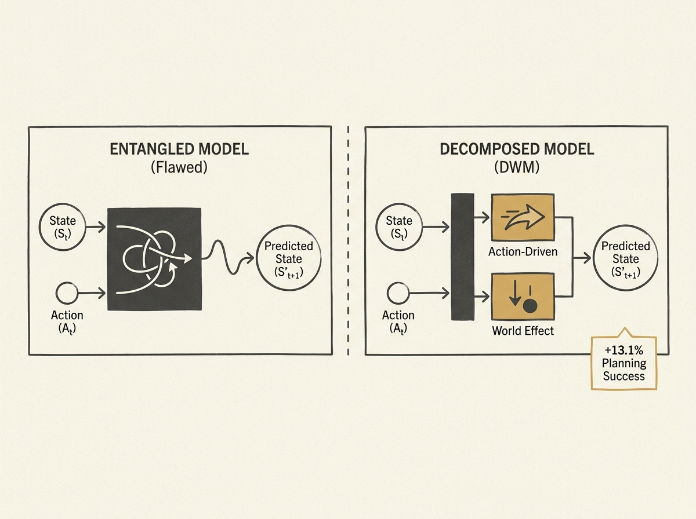

The way we train latent world models for AI agents is fundamentally flawed, forcing a single learning signal to absorb all changes, whether they are from an agent's action or the environment's inherent dynamics.

This entanglement limits transferability and agent planning. The new DWM (Decomposed World Model) framework fixes this by explicitly decomposing the predicted transition into an action-invariant world effect (e.g., gravity, inertia) and an action-driven component. It does this without altering the underlying architecture, simply by augmenting the predictor with an auxiliary world head and clever regularization.

Across control benchmarks with persistent world effects, DWM achieves a mean absolute improvement of 13.1 percent in CEM planning success. This is a significant leap for model-based control, leading to more robust and transferable AI agents. Anyone working on agentic systems should explore this decomposition for better learning and planning.